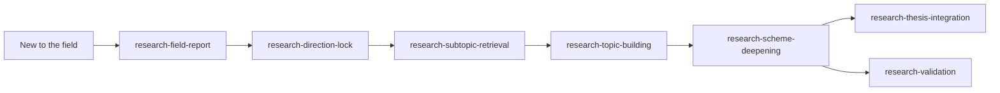

# lab-skills

[简体中文](README.md) | [English](README.en.md)

A collection of AI agent skills for scientific and laboratory work. Each skill lives under `skills/<name>/` and includes its own entry point and supporting materials.

## Skills index

| Skill | Domain | Description |
|---|---|---|
| [matplot-publisher](skills/matplot-publisher/) | Scientific plotting | Turns .mat oscilloscope waveforms into publication-ready PDF and 600 DPI PNG files, with preview confirmation before export. |
| [adhd-brain-dump](skills/adhd-brain-dump/) | Task management | Turns a brain dump into lists, milestones, and micro-steps, then syncs them to Microsoft To Do. |
| [research-field-report](skills/research-field-report/) | Field landscape | Builds a literature database and reports on a field's landscape, trends, gaps, feasibility, and competition. |
| [research-direction-lock](skills/research-direction-lock/) | Direction selection | Uses reports and evidence to discuss and settle on a user-approved research direction. |
| [research-subtopic-retrieval](skills/research-subtopic-retrieval/) | Subtopic search | Searches a locked direction, validates queries, and adds traceable evidence. |
| [research-topic-building](skills/research-topic-building/) | Topic ideation | Proposes, compares, and validates structured research topics from literature evidence. |
| [research-scheme-deepening](skills/research-scheme-deepening/) | Proposal refinement | Screens topic candidates and deepens the selected research plans. |
| [research-thesis-integration](skills/research-thesis-integration/) | Thesis integration | Organizes mature topics into a thesis argument, narrative, and chapter structure. |
| [research-validation](skills/research-validation/) | Full validation | Moves from MVE paths and retrieval evidence to step-by-step experimental plans. |

## Research workflow

These seven research skills cover the path from exploring a field to validating a research topic. Start at the stage that matches your current materials; you do not need to begin at the first step every time.



| Your current task | Suggested starting point |
|---|---|
| Understand an unfamiliar field, its trends, and research gaps | [research-field-report](skills/research-field-report/) |
| Choose a direction and record the rationale | [research-direction-lock](skills/research-direction-lock/) |
| Add search evidence to a chosen direction | [research-subtopic-retrieval](skills/research-subtopic-retrieval/) |
| Generate a pool of topics from evidence | [research-topic-building](skills/research-topic-building/) |
| Assess and deepen a specific topic | [research-scheme-deepening](skills/research-scheme-deepening/) |
| Turn several topics into a thesis narrative | [research-thesis-integration](skills/research-thesis-integration/) |
| Validate a topic and refine experimental steps | [research-validation](skills/research-validation/) |

A common sequence is “field report → direction selection → subtopic retrieval → topic ideation → proposal refinement.” From there, continue with thesis integration or full validation. Key human decisions—including direction selection, validation scope, and Gate 3 decisions—remain with the user.

## Repository layout

```text
lab-skills/
├── README.md                 # Chinese homepage
├── README.en.md              # English homepage
├── LICENSE
└── skills/
    └── <skill-name>/
        ├── SKILL.md          # skill entry point and execution rules
        ├── README.md         # quick start
        ├── references/       # contracts and detailed guidance
        ├── scripts/          # executable helpers
        ├── prompts/          # stage prompts
        └── tests/            # local tests
```

## Usage and contribution

- Keep each skill self-contained in its own directory; do not depend on files from another skill.
- Read the skill's `README.md` for a quick overview, then follow its `SKILL.md`.
- Provide credentials through environment variables or local external files; never commit them.
- Follow each skill's `README.md` and `references/` for setup and execution details.
- Contributions are welcome via Pull Request. Each skill should document its own dependencies.

## License

[MIT](LICENSE).
