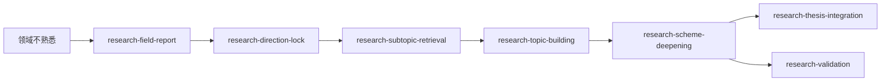

# lab-skills

[简体中文](README.md) | [English](README.en.md)

面向科研与实验室工作的 AI agent skills 集合。每个 skill 位于 `skills/<name>/`，包含自己的入口说明和所需材料。

## Skills 索引

| Skill | 领域 | 简介 |
|---|---|---|
| [matplot-publisher](skills/matplot-publisher/) | 科研绘图 | 将 .mat 示波器波形处理为适合发表的 PDF 和 600 DPI PNG，并在导出前进行预览确认。 |
| [adhd-brain-dump](skills/adhd-brain-dump/) | 任务管理 | 将脑内待办整理为清单、里程碑和微步骤，并同步到 Microsoft To Do。 |
| [research-field-report](skills/research-field-report/) | 领域摸底 | 从文献库生成领域全景、趋势、空白、可行性与竞争态势报告。 |
| [research-direction-lock](skills/research-direction-lock/) | 方向锁定 | 基于报告和证据进行讨论，确定用户认可的研究方向。 |
| [research-subtopic-retrieval](skills/research-subtopic-retrieval/) | 子问题检索 | 围绕已锁定方向检索、验证搜索式并补齐可追溯证据。 |
| [research-topic-building](skills/research-topic-building/) | 课题孵化 | 从文献证据中提出、比较并校验结构化课题。 |
| [research-scheme-deepening](skills/research-scheme-deepening/) | 方案深化 | 筛选课题候选，并深化选定方案。 |
| [research-thesis-integration](skills/research-thesis-integration/) | 论文整合 | 将多个成熟课题组织为论文论点、故事线和章节结构。 |
| [research-validation](skills/research-validation/) | 完整验证 | 从 MVE 与检索证据推进到逐步骤实验方案。 |

## Research 工作流

这七个 research skills 覆盖从领域摸底到课题验证的关键阶段。根据手头材料选择入口，不必每次从头开始。



| 当前任务 | 建议入口 |
|---|---|
| 了解陌生领域、趋势和研究空白 | [research-field-report](skills/research-field-report/) |
| 在候选方向中做选择并记录理由 | [research-direction-lock](skills/research-direction-lock/) |
| 为已确定的方向补充检索证据 | [research-subtopic-retrieval](skills/research-subtopic-retrieval/) |
| 从证据中孵化一批课题候选 | [research-topic-building](skills/research-topic-building/) |
| 评估并深化具体课题 | [research-scheme-deepening](skills/research-scheme-deepening/) |
| 把多个课题组织成论文主线 | [research-thesis-integration](skills/research-thesis-integration/) |
| 验证课题并细化实验步骤 | [research-validation](skills/research-validation/) |

常见顺序是“领域报告 → 方向锁定 → 子问题检索 → 课题孵化 → 方案深化”。深化后可继续论文整合，也可开展完整验证。方向选择、验证对象和闸门 3 等关键人工决策由用户完成。

## 目录结构

```text
lab-skills/
├── README.md                 # 中文首页
├── README.en.md              # English homepage
├── LICENSE
└── skills/
    └── <skill-name>/
        ├── SKILL.md          # skill 入口与执行规则
        ├── README.md         # 快速上手
        ├── references/       # 契约与详细说明
        ├── scripts/          # 执行脚本
        ├── prompts/          # 阶段提示词
        └── tests/            # 本地测试
```

## 使用与贡献约定

- 每个 skill 独立放在一个目录中，不依赖其他 skill 的文件。
- 从该目录的 `README.md` 快速了解用途，再阅读 `SKILL.md` 开始执行。
- 凭据只通过环境变量或本机外置文件提供，不要提交到仓库。
- 测试和运行说明以各 skill 的 `README.md` 与 `references/` 为准。
- 欢迎通过 Pull Request 添加或改进 skill；每个 skill 应提供自己的依赖说明。

## License

[MIT](LICENSE)。
