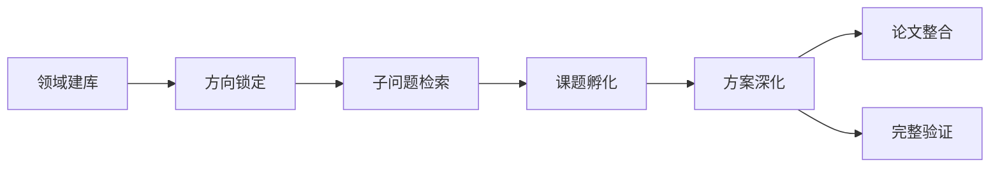
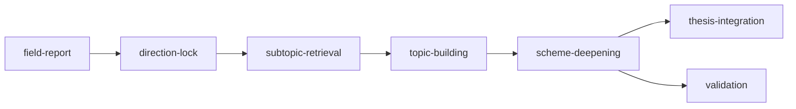

# lab-skills

科研与实验工作流的 AI agent skill 合集 · A collection of agent skills for scientific & lab research workflows.

**语言 / Language：[中文](#中文) · [English](#english)**

---

## 中文

每个技能位于 `skills/` 下独立目录，自包含、可单独取用：入口 `SKILL.md`（描述、触发条件、步骤、规则）+ 可运行库 + 脚本 + 提示词 + 参考资料 + 测试。

### 技能一览

**科研工作流 · 7 个技能** —— 覆盖从领域摸底到论文主线的完整流程。不必每次从头开始，按你手上的材料选入口：

| 技能 | 阶段 | 一句话 | 交付物 |
|---|---|---|---|
| [research-field-report](skills/research-field-report/) | 领域建库 | 从关键词建 Scopus 文献库，产出领域全景、趋势、空白、可行性与竞争态势报告 | `reports/`：21 列文献库 + 5 份报告 |
| [research-direction-lock](skills/research-direction-lock/) | 方向锁定 | 基于 5 份报告经讨论选定一个研究方向 | `direction.md` |
| [research-subtopic-retrieval](skills/research-subtopic-retrieval/) | 子问题检索 | 围绕锁定方向拆实体、确认术语、重检索，补齐方向证据 | 23 列 `evidence.csv` |
| [research-topic-building](skills/research-topic-building/) | 课题孵化 | 分批分析方向证据，提出、比较并校验结构化课题 | `topics/` 课题池 |
| [research-scheme-deepening](skills/research-scheme-deepening/) | 方案深化 | 筛选强相关文献，把课题深化为可检查的研究方案 | `screening.md` + `deepened.md` |
| [research-thesis-integration](skills/research-thesis-integration/) | 论文整合 | 把多个成熟课题组织成论点、故事线与章节结构 | `thesis/`：论点 / 故事 / 结构 |
| [research-validation](skills/research-validation/) | 完整验证 | 设计 MVE、检索实现证据并逐步骤细化实验方案 | MVE + 逐步骤实验方案 |

流程关系：



| 你现在要做什么 | 入口 |
|---|---|
| 了解陌生领域、趋势与研究空白 | [research-field-report](skills/research-field-report/) |
| 在候选方向中选择并记录研究方向 | [research-direction-lock](skills/research-direction-lock/) |
| 为已锁定方向补检索证据 | [research-subtopic-retrieval](skills/research-subtopic-retrieval/) |
| 从证据中形成一批课题候选 | [research-topic-building](skills/research-topic-building/) |
| 评估并深化具体课题 | [research-scheme-deepening](skills/research-scheme-deepening/) |
| 把多个课题组织成论文主线 | [research-thesis-integration](skills/research-thesis-integration/) |
| 验证课题并细化实验步骤 | [research-validation](skills/research-validation/) |

建议顺序：领域建库 → 方向锁定 → 子问题检索 → 课题孵化 → 方案深化；深化后按目标继续论文整合或完整验证。方向选择、验证对象等人工决策由用户拍板，技能负责提供证据与方案。

**独立工具 · 2 个技能**

| 技能 | 领域 | 一句话 |
|---|---|---|
| [matplot-publisher](skills/matplot-publisher/) | 科研绘图 | 把 `.mat` 示波器波形（最高约 1 亿点）变成出版级 PDF + 600 DPI PNG；六层流水线（感知 → 理解 → 决策 → 验证 → 执行 → 固化），正式出图前必须预览确认 |
| [adhd-brain-dump](skills/adhd-brain-dump/) | ADHD 任务管理 | 无评判三段式：思维倾倒（「倾倒：」）→ 大任务拆成里程碑与微步骤（「拆分：」）→ 批量同步到 Microsoft To Do |

### 使用

把 `skills/<技能名>/` 整个目录复制到你所用 agent 的 skills 目录（如 `.claude/skills/`、`.agents/skills/`），agent 启动时自动加载其中的 `SKILL.md`。先读该技能自己的 README（如有）和 `SKILL.md`，了解输入输出与执行方式。

### 目录结构

```
lab-skills/
├── README.md                  # 本文件
├── LICENSE                    # MIT
├── .gitignore
└── skills/
    └── <skill-name>/
        ├── SKILL.md           # 入口：描述、触发条件、步骤、规则
        ├── README.md          # 安装 / CLI / API 快速上手
        ├── requirements.txt   # 该技能自己的依赖
        ├── <package>/         # 可运行库
        ├── scripts/           # CLI / 自检脚本
        ├── prompts/           # 子 agent 提示词
        ├── agents/            # 子 agent 接口描述
        ├── references/        # 长文规则与规范
        ├── tests/
        └── examples/ · profiles/
```

各技能按需取舍，并非每个目录都包含全部子项。

### 约定

- 一个技能一个目录，置于 `skills/` 下；技能之间不互相 import。
- `SKILL.md` front-matter 必须含 `name` + `description`；description 同时充当触发条件，保持可扫读。
- 运行产物（预览 PNG、中间 `.npy`、生成的 PDF）已由 .gitignore 排除，需要时从技能本身重新生成。
- 测试随技能本地存放，在技能根目录执行：`cd skills/<skill-name> && pytest`。
- Scopus 等凭据经环境变量或本地外置文件提供，不得提交进仓库。

### 贡献

1. 在 `skills/<你的技能>/` 下新增技能。
2. `SKILL.md` 遵循上述结构（`name`、`description`、步骤章节）。
3. 提交 PR，并附上该技能自己的 `requirements.txt`（不共用顶层依赖文件）。

### 许可

[MIT](LICENSE)。

---

## English

A collection of self-contained agent skills for scientific and lab research workflows. Each skill lives in its own directory under `skills/`: an entry `SKILL.md` (description, triggers, steps, rules) plus a runnable library, scripts, prompts, references and tests.

### Skills at a glance

**Research workflow · 7 skills** — the full arc from field survey to thesis storyline. Start wherever your materials allow; you don't have to begin at the top every time.

| Skill | Stage | In one line | Output |
|---|---|---|---|
| [research-field-report](skills/research-field-report/) | Field survey | Build a Scopus literature DB from keywords; produce overview, trends, gaps, feasibility and landscape reports | `reports/`: 21-column DB + 5 reports |
| [research-direction-lock](skills/research-direction-lock/) | Direction lock | Discuss the 5 reports down to one confirmed research direction | `direction.md` |
| [research-subtopic-retrieval](skills/research-subtopic-retrieval/) | Subtopic retrieval | Split entities, confirm terms and re-search around the locked direction | 23-column `evidence.csv` |
| [research-topic-building](skills/research-topic-building/) | Topic building | Analyze direction evidence in batches; propose, compare and validate structured topics | `topics/` pool |
| [research-scheme-deepening](skills/research-scheme-deepening/) | Scheme deepening | Screen highly relevant literature and deepen each topic into a checkable plan | `screening.md` + `deepened.md` |
| [research-thesis-integration](skills/research-thesis-integration/) | Thesis integration | Organize mature topics into an argument, storyline and chapter structure | `thesis/`: argument / story / structure |
| [research-validation](skills/research-validation/) | Full validation | Design the MVE, retrieve implementation evidence and refine step-by-step protocols | MVE + step-by-step protocol |

How they chain:



| What you want to do | Start with |
|---|---|
| Get to know an unfamiliar field, its trends and gaps | [research-field-report](skills/research-field-report/) |
| Choose and record a research direction | [research-direction-lock](skills/research-direction-lock/) |
| Gather retrieval evidence for a locked direction | [research-subtopic-retrieval](skills/research-subtopic-retrieval/) |
| Turn evidence into a batch of topic candidates | [research-topic-building](skills/research-topic-building/) |
| Evaluate and deepen a specific topic | [research-scheme-deepening](skills/research-scheme-deepening/) |
| Organize several topics into a thesis storyline | [research-thesis-integration](skills/research-thesis-integration/) |
| Validate a topic and refine experiment steps | [research-validation](skills/research-validation/) |

A typical order is field report → direction lock → subtopic retrieval → topic building → scheme deepening; afterwards continue with thesis integration or full validation depending on the goal. Human decisions (direction choice, validation targets) stay with the user; the skills supply evidence and plans.

**Standalone tools · 2 skills**

| Skill | Domain | In one line |
|---|---|---|
| [matplot-publisher](skills/matplot-publisher/) | Scientific plotting | Turn `.mat` oscilloscope waveforms (up to ~100M points) into publication-grade PDF + 600 DPI PNG; six-layer pipeline (perceive → interpret → decide → validate → execute → crystallize) with mandatory preview confirmation |
| [adhd-brain-dump](skills/adhd-brain-dump/) | ADHD task management | Judgment-free three stages: brain-dump triage (「倾倒：」) → split big tasks into milestones & micro-steps (「拆分：」) → batch-sync tasks, subtasks, notes and due dates to Microsoft To Do |

### Usage

Copy `skills/<skill-name>/` as a whole into your agent's skills directory (e.g. `.claude/skills/`, `.agents/skills/`); the agent picks up its `SKILL.md` automatically. Read the skill's own README (where present) and `SKILL.md` first for inputs, outputs and how to run it.

### Layout

```
lab-skills/
├── README.md                  # this file
├── LICENSE                    # MIT
├── .gitignore
└── skills/
    └── <skill-name>/
        ├── SKILL.md           # entry point — description, triggers, steps, rules
        ├── README.md          # install / CLI / API quickstart
        ├── requirements.txt   # per-skill dependencies
        ├── <package>/         # runnable library
        ├── scripts/           # CLI / selfcheck helpers
        ├── prompts/           # sub-agent prompts
        ├── agents/            # sub-agent interface descriptors
        ├── references/        # long-form rules & specs
        ├── tests/
        └── examples/ · profiles/
```

Skills take what they need; not every directory contains every sub-item.

### Conventions

- One skill per directory under `skills/`. No cross-skill imports.
- `SKILL.md` front-matter carries `name` + `description`; the description doubles as the trigger list — keep it scannable.
- Runtime artefacts (preview PNGs, intermediate `.npy`, generated PDFs) are git-ignored; reproduce them from the skill itself.
- Tests are local to each skill. Run from the skill root: `cd skills/<skill-name> && pytest`.
- Scopus and other credentials come from environment variables or local out-of-repo files; never commit them.

### Contributing

1. Add your skill under `skills/<your-skill>/`.
2. Make sure `SKILL.md` follows the schema (`name`, `description`, steps section).
3. Open a PR. Include the skill's own `requirements.txt` (don't share a top-level one).

### License

[MIT](LICENSE).
