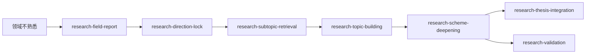

# lab-skills

A collection of agent skills for scientific / lab research workflows. Each skill under
[`skills/`](skills/) is self-contained and follows the standard agent skill layout
(`SKILL.md` + runnable library + tests + references).

## Skills index

| Skill | Domain | One-liner |
|---|---|---|
| [matplot-publisher](skills/matplot-publisher/) | Scientific plotting | Turn `.mat` oscilloscope waveforms (up to ~100M points) into publication-grade PDF + 600 DPI PNG, with a 6-layer pipeline (perceive → interpret → decide → validate → execute → crystallize) and mandatory preview confirmation. |
| [adhd-brain-dump](skills/adhd-brain-dump/) | ADHD task management | Non-judgmental 3-stage pipeline for ADHD brains: brain-dump triage (「倾倒：」) → big-task splitting into milestones & micro-steps with interactive context gathering (「拆分：」) → auto-sync tasks, subtasks, notes and due dates to Microsoft To Do via `microsoft-todo-cli`. |

| [research-field-report](skills/research-field-report/) | 领域摸底 | 从文献库生成领域全景、趋势、空白、可行性和竞争态势报告。 |
| [research-direction-lock](skills/research-direction-lock/) | 方向锁定 | 基于报告与证据，通过讨论确定用户确认的方向。 |
| [research-subtopic-retrieval](skills/research-subtopic-retrieval/) | 子问题检索 | 围绕已锁定方向检索、验证搜索式并补齐证据。 |
| [research-topic-building](skills/research-topic-building/) | 课题孵化 | 从文献证据批量提出、比较并校验结构化课题。 |
| [research-scheme-deepening](skills/research-scheme-deepening/) | 方案深化 | 筛选课题候选，把选定方案深化为可检查的计划。 |
| [research-thesis-integration](skills/research-thesis-integration/) | 论文整合 | 将多个成熟课题组织为论点、故事线和章节结构。 |
| [research-validation](skills/research-validation/) | 完整验证 | 从 MVE 和 LOOP A 检索推进到逐步骤实验方案。 |

More skills will land here as they mature.

## Research workflow skills

这七个技能覆盖科研选题从领域摸底到方案验证的关键阶段。按当前已有材料选择入口，不必每次从头开始。



| 你现在要做什么 | 从这里开始 |
|---|---|
| 了解陌生领域、趋势与研究空白 | [research-field-report](skills/research-field-report/) |
| 在候选中选择并记录研究方向 | [research-direction-lock](skills/research-direction-lock/) |
| 为已确定方向补检索证据 | [research-subtopic-retrieval](skills/research-subtopic-retrieval/) |
| 从证据中形成一批课题候选 | [research-topic-building](skills/research-topic-building/) |
| 评估和深化具体课题 | [research-scheme-deepening](skills/research-scheme-deepening/) |
| 把多个课题组织成论文主线 | [research-thesis-integration](skills/research-thesis-integration/) |
| 验证课题并细化实验步骤 | [research-validation](skills/research-validation/) |

建议顺序是“领域报告 → 方向锁定 → 子问题检索 → 课题孵化 → 方案深化”。深化后可按目标继续做论文整合或完整验证。方向选择、验证对象和闸门 3 等人工决策由用户完成。每个技能目录都附有本地 README、`SKILL.md`、执行说明和所需 references、scripts、prompts、tests。先读对应 README 判断输入输出，再从 `SKILL.md` 执行。Scopus 凭据通过环境变量或本地外置文件提供，不能提交到仓库。

## Layout

```
lab-skills/
├── README.md                     # this file
├── LICENSE                       # MIT
├── .gitignore
└── skills/
    └── <skill-name>/
        ├── SKILL.md              # entry point — description, triggers, steps, rules
        ├── README.md             # install / CLI / API quickstart
        ├── requirements.txt
        ├── <package>/            # runnable library
        ├── scripts/              # CLI / selfcheck helpers
        ├── references/           # long-form rules & specs
        ├── tests/
        ├── examples/
        └── profiles/             # success-profile archives (per-skill)
```

## Conventions

- One skill per directory under `skills/`. No cross-skill imports.
- `SKILL.md` front-matter carries `name` + `description` (description doubles as the
  trigger list — keep it scannable).
- Runtime artefacts (preview PNGs, intermediate `.npy`, generated PDFs) are
  git-ignored; reproduce them from the skill itself.
- Tests are local to each skill. Run from the skill root:
  `cd skills/<skill-name> && pytest`.

## Contributing

1. Add your skill under `skills/<your-skill>/`.
2. Make sure `SKILL.md` follows the schema (`name`, `description`, `## 步骤` / steps).
3. Open a PR. Include the skill's own `requirements.txt` (don't share a top-level one).

## License

[MIT](LICENSE).
